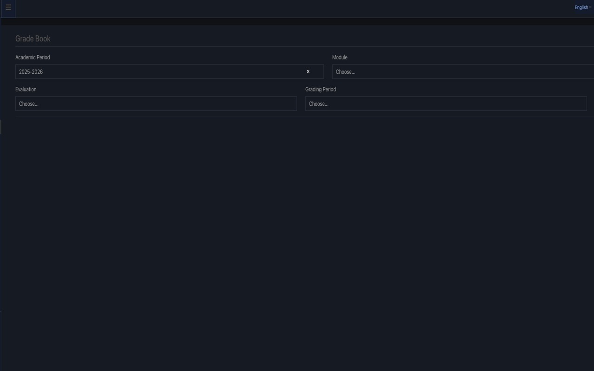

# MC-Class Dark Theme (Chrome Extension)

Chrome extension version of the `mc-class.gr` dark theme.

## Install

### Recommended
Chrome Web Store:
- https://chromewebstore.google.com/detail/mc-class-dark-theme/laembkhianpaagagkjjhdhkjmpbhpijb

### Local development / manual install
1. Open `chrome://extensions`
2. Enable **Developer mode**
3. Click **Load unpacked**
4. Select this folder

## Features
- Dark theme styles aligned with the Firefox and Tampermonkey versions
- Improved readability and component-specific overrides
- Replaces default `NoPhoto.jpg` placeholders with a dark preview image

## Files
- `manifest.json`
- `dark.css`
- `content.js`

## License
See [LICENSE](LICENSE).

## Changelog
See [CHANGELOG.md](CHANGELOG.md).

## Support
For issues, use [GitHub Issues](https://github.com/ek-mc/mc-class-dark-chrome-extension/issues).

## Automation
This repository uses GitHub Actions workflows:
- `ci.yml`
